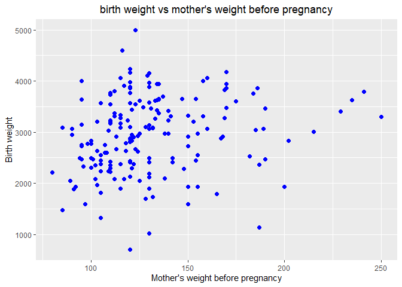
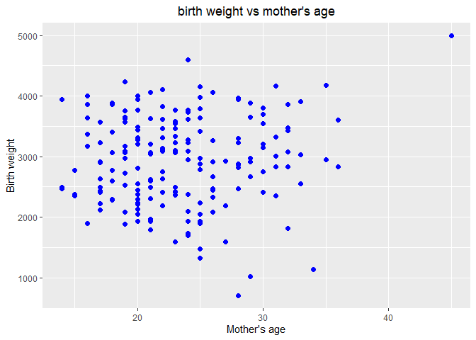
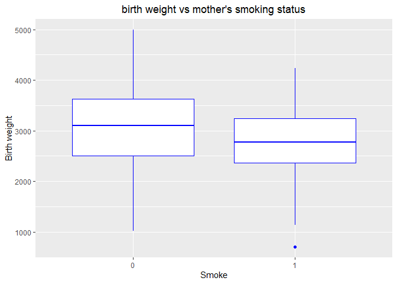
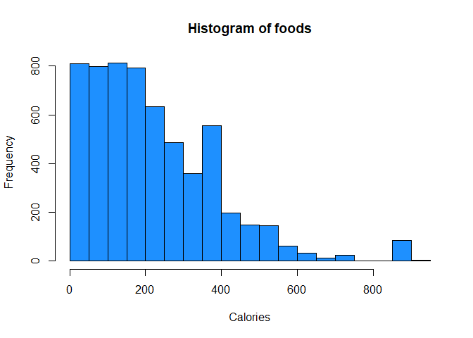
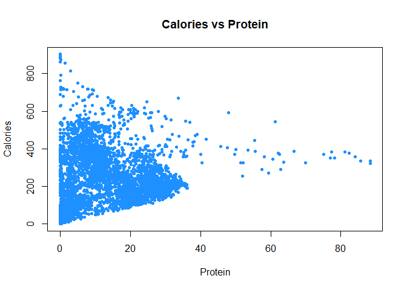
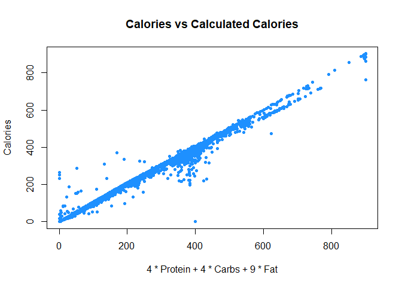

Week 1 - Homework
================
STAT 420, Summer 2021, Haixu Leng (NetID: haixul2)
05/22/2021

-   [Exercise 1 (Subsetting and
    Statistics)](#exercise-1-subsetting-and-statistics)
-   [Exercise 2 (Plotting)](#exercise-2-plotting)
-   [Exercise 3 (Importing Data, More
    Plotting)](#exercise-3-importing-data-more-plotting)
-   [Exercise 4 (Writing and Using
    Functions)](#exercise-4-writing-and-using-functions)
-   [Exercise 5 (More Writing and Using
    Functions)](#exercise-5-more-writing-and-using-functions)

------------------------------------------------------------------------

## Exercise 1 (Subsetting and Statistics)

For this exercise, we will use the `msleep` dataset from the `ggplot2`
package.

**(a)** Install and load the `ggplot2` package. **Do not** include the
installation command in your `.Rmd` file. (If you do it will install the
package every time you knit your file.) **Do** include the command to
load the package into your environment.

``` r
library(ggplot2)
```

**(b)** Note that this dataset is technically a `tibble`, not a data
frame. How many observations are in this dataset? How many variables?
What are the observations in this dataset?

``` r
str(msleep)
```

    ## tibble [83 x 11] (S3: tbl_df/tbl/data.frame)
    ##  $ name        : chr [1:83] "Cheetah" "Owl monkey" "Mountain beaver" "Greater short-tailed shrew" ...
    ##  $ genus       : chr [1:83] "Acinonyx" "Aotus" "Aplodontia" "Blarina" ...
    ##  $ vore        : chr [1:83] "carni" "omni" "herbi" "omni" ...
    ##  $ order       : chr [1:83] "Carnivora" "Primates" "Rodentia" "Soricomorpha" ...
    ##  $ conservation: chr [1:83] "lc" NA "nt" "lc" ...
    ##  $ sleep_total : num [1:83] 12.1 17 14.4 14.9 4 14.4 8.7 7 10.1 3 ...
    ##  $ sleep_rem   : num [1:83] NA 1.8 2.4 2.3 0.7 2.2 1.4 NA 2.9 NA ...
    ##  $ sleep_cycle : num [1:83] NA NA NA 0.133 0.667 ...
    ##  $ awake       : num [1:83] 11.9 7 9.6 9.1 20 9.6 15.3 17 13.9 21 ...
    ##  $ brainwt     : num [1:83] NA 0.0155 NA 0.00029 0.423 NA NA NA 0.07 0.0982 ...
    ##  $ bodywt      : num [1:83] 50 0.48 1.35 0.019 600 ...

``` r
#?msleep
```

There are 83 observations and 11 variables. Each observation is a
collection of sleep data of a mammal.

**(c)** What is the mean hours of REM sleep of individuals in this
dataset?

``` r
rem_mean = mean(msleep$sleep_rem, na.rm = TRUE)
```

Mean hours of REM sleep if individuals in this dataset is 1.8754098.

**(d)** What is the standard deviation of brain weight of individuals in
this dataset?

``` r
brainwt_std = sd(msleep$brainwt, na.rm = TRUE)
```

Standard deviation of brain weight of individuals in this dataset is
0.9764137

**(e)** Which observation (provide the `name`) in this dataset gets the
most REM sleep?

``` r
mammal_most_rem = msleep$name[which.max(msleep$sleep_rem)]
```

It is Thick-tailed opposum who gets the most REM sleep.

**(f)** What is the average bodyweight of carnivores in this dataset?

``` r
ave_wt_crn = mean(msleep$bodywt[msleep$vore == 'carni'], na.rm = TRUE)
```

The average bodyweight of carnivores in this dataset is 90.7511053.

------------------------------------------------------------------------

## Exercise 2 (Plotting)

For this exercise, we will use the `birthwt` dataset from the `MASS`
package.

**(a)** Note that this dataset is a data frame and all of the variables
are numeric. How many observations are in this dataset? How many
variables? What are the observations in this dataset?

``` r
library(MASS)
str(birthwt)
```

    ## 'data.frame':    189 obs. of  10 variables:
    ##  $ low  : int  0 0 0 0 0 0 0 0 0 0 ...
    ##  $ age  : int  19 33 20 21 18 21 22 17 29 26 ...
    ##  $ lwt  : int  182 155 105 108 107 124 118 103 123 113 ...
    ##  $ race : int  2 3 1 1 1 3 1 3 1 1 ...
    ##  $ smoke: int  0 0 1 1 1 0 0 0 1 1 ...
    ##  $ ptl  : int  0 0 0 0 0 0 0 0 0 0 ...
    ##  $ ht   : int  0 0 0 0 0 0 0 0 0 0 ...
    ##  $ ui   : int  1 0 0 1 1 0 0 0 0 0 ...
    ##  $ ftv  : int  0 3 1 2 0 0 1 1 1 0 ...
    ##  $ bwt  : int  2523 2551 2557 2594 2600 2622 2637 2637 2663 2665 ...

``` r
#?birthwt
```

There are 189 observations and 10 variables. Each observation is a
collection of information of an infant. The data were collected at
Baystate Medical Center, Springfield, Mass during 1986.

**(b)** Create a scatter plot of birth weight (y-axis) vs mother’s
weight before pregnancy (x-axis). Use a non-default color for the
points. (Also, be sure to give the plot a title and label the axes
appropriately.) Based on the scatter plot, does there seem to be a
relationship between the two variables? Briefly explain.

``` r
ggplot(data = birthwt, mapping = aes(y = bwt, x = lwt)) + geom_point(size=2, color = "blue") + 
  ggtitle("birth weight vs mother's weight before pregnancy") + 
  theme(plot.title = element_text(hjust = 0.5)) + labs(x = "Mother's weight before pregnancy", y = "Birth weight")
```

<!-- -->

I **don’t think** there is a clear relationship between the two
variables. For example, mothers with a weight around 125 pounds can to
give births to infants in any weight category. Note, mothers weight more
than 200 pounds seem to consistently give birth to baby heavier than
3000 grams, but there are not many data points in this range.

**(c)** Create a scatter plot of birth weight (y-axis) vs mother’s age
(x-axis). Use a non-default color for the points. (Also, be sure to give
the plot a title and label the axes appropriately.) Based on the scatter
plot, does there seem to be a relationship between the two variables?
Briefly explain.

``` r
ggplot(data = birthwt, mapping = aes(y = bwt, x = age)) + geom_point(size=2, color = "blue") + 
  ggtitle("birth weight vs mother's age") + 
  theme(plot.title = element_text(hjust = 0.5)) + labs(x = "Mother's age", y = "Birth weight")
```

<!-- -->

I **don’t think** there is a clear relationship between the two
variables. The range of infant weight spreads evenly across different
age groups of mothers. Note, there is an outlier at the upper-right
corner.

**(d)** Create side-by-side boxplots for birth weight grouped by smoking
status. Use non-default colors for the plot. (Also, be sure to give the
plot a title and label the axes appropriately.) Based on the boxplot,
does there seem to be a difference in birth weight for mothers who
smoked? Briefly explain.

``` r
ggplot(data = birthwt, mapping = aes(y = bwt, x = as.factor(smoke))) + geom_boxplot(color = "blue", notch=FALSE) + 
  ggtitle("birth weight vs mother's smoking status") + 
  theme(plot.title = element_text(hjust = 0.5)) + labs(x = "Smoke", y = "Birth weight")
```

<!-- -->

Yes, there seems to be a **weak** difference in birth weight for mothers
who smoked. The group of mothers who smoked has a lower median birth
weight, a lower value for the lower quartile and the upper quartile.
Note, The median of birth weight of mother who smoked is still fairly
close to the median birth weight of mothers who did not smoke. So the
whether the difference between these two groups is statistically
significant or not requires more detailed study of the data.

------------------------------------------------------------------------

## Exercise 3 (Importing Data, More Plotting)

For this exercise we will use the data stored in
[`nutrition-2018.csv`](nutrition-2018.csv). It contains the nutritional
values per serving size for a large variety of foods as calculated by
the USDA in 2018. It is a cleaned version totaling 5956 observations and
is current as of April 2018.

The variables in the dataset are:

-   `ID`
-   `Desc` - short description of food
-   `Water` - in grams
-   `Calories` - in kcal
-   `Protein` - in grams
-   `Fat` - in grams
-   `Carbs` - carbohydrates, in grams
-   `Fiber` - in grams
-   `Sugar` - in grams
-   `Calcium` - in milligrams
-   `Potassium` - in milligrams
-   `Sodium` - in milligrams
-   `VitaminC` - vitamin C, in milligrams
-   `Chol` - cholesterol, in milligrams
-   `Portion` - description of standard serving size used in analysis

**(a)** Create a histogram of `Calories`. Do not modify `R`’s default
bin selection. Make the plot presentable. Describe the shape of the
histogram. Do you notice anything unusual?

``` r
nutrition = read.csv("nutrition-2018.csv")
hist(nutrition$Calories, 
     xlab = "Calories", 
     main   = "Histogram of foods",
     col    = "dodgerblue")
```

<!-- -->

Most of the food seem to have calories less than 300, and the
distribution is left-skewed. There are two unusual things. First there
are some foods with over 800 calories, which look like outliers. Second,
there are many foods have 350\~400 calories, which make a peak in the
distribution curve.

**(b)** Create a scatter plot of calories (y-axis) vs protein (x-axis).
Make the plot presentable. Do you notice any trends? Do you think that
knowing only the protein content of a food, you could make a good
prediction of the calories in the food?

``` r
plot(Calories ~ Protein, data = nutrition,
     xlab = "Protein",
     ylab = "Calories",
     main = "Calories vs Protein",
     pch  = 20,
     cex  = 1,
     col = "dodgerblue")
```

<!-- -->

There is no clear trend. But I notice that the variation of calories is
high when the protein is low. At a high protein level, the calories
variation is low. I could **not** make a good prediction of the calories
in the food knowing only the protein content of a food.

**(c)** Create a scatter plot of `Calories` (y-axis) vs
`4 * Protein + 4 * Carbs + 9 * Fat` (x-axis). Make the plot presentable.
You will either need to add a new variable to the data frame, or use the
`I()` function in your formula in the call to `plot()`. If you are at
all familiar with nutrition, you may realize that this formula
calculates the calorie count based on the protein, carbohydrate, and fat
values. You’d expect then that the result here is a straight line. Is
it? If not, can you think of any reasons why it is not?

``` r
calculated_calories = 4 * nutrition$Protein + 4 * nutrition$Carbs + 9 * nutrition$Fat
nutrition$Calculated_calories = calculated_calories
plot(Calories ~ Calculated_calories, data = nutrition,
     xlab = "4 * Protein + 4 * Carbs + 9 * Fat",
     ylab = "Calories",
     main = "Calories vs Calculated Calories",
     pch  = 20,
     cex  = 1,
     col = "dodgerblue")
```

<!-- -->

Overall the result is linear, meaning that the calculated calories using
the formula is very close to the true calories. There are some
variations from a straight line at several places, maybe the formula can
not acurately cover all the foods. Or, the provided information is not
accurate for some of the attributes.

------------------------------------------------------------------------

## Exercise 4 (Writing and Using Functions)

For each of the following parts, use the following vectors:

``` r
a = 1:10
b = 10:1
c = rep(1, times = 10)
d = 2 ^ (1:10)
```

**(a)** Write a function called `sum_of_squares`.

-   Arguments:
    -   A vector of numeric data `x`
-   Output:
    -   The sum of the squares of the elements of the vector
        $\\sum\_{i = 1}^n x\_i^2$

Provide your function, as well as the result of running the following
code:

``` r
sum_of_squares(x = a)
sum_of_squares(x = c(c, d))
```

``` r
# define the required function
sum_of_squares = function(x){
  return (sum(x^2))
}

sum_of_squares(x = a)
```

    ## [1] 385

``` r
sum_of_squares(x = c(c, d))
```

    ## [1] 1398110

**(b)** Using only your function `sum_of_squares()`, `mean()`, `sqrt()`,
and basic math operations such as `+` and `-`, calculate

$$
\\sqrt{\\frac{1}{n}\\sum\_{i = 1}^n (x\_i - 0)^{2}}
$$

where the *x* vector is `d`.

``` r
sqrt(sum_of_squares(x = d) / length(d))
```

    ## [1] 373.9118

**Note**: Professor Unger says the usage of `length` is permissible on
*campuswire*.

**(c)** Using only your function `sum_of_squares()`, `mean()`, `sqrt()`,
and basic math operations such as `+` and `-`, calculate

$$
\\sqrt{\\frac{1}{n}\\sum\_{i = 1}^n (x\_i - y\_i)^{2}}
$$

where the *x* vector is `a` and the *y* vector is `b`.

First, lets rewrite the formula:

$$
\\sqrt{\\frac{1}{n}\\sum\_{i = 1}^n (x\_i - y\_i)^{2}} = \\sqrt{\\frac{1}{n}(\\sum\_{i = 1}^n x\_i^{2} + \\sum\_{i = 1}^n y\_i^{2} - \\sum\_{i = 1}^n 2x\_i y\_i)}
$$

``` r
# first component
x = a
x_2 = sum_of_squares(x) / length(x)

# second component
y = b
y_2 = sum_of_squares(y) / length(y)

# third component
xy = 2 * mean(x * y)

sqrt(x_2 + y_2 - xy)
```

    ## [1] 5.744563

------------------------------------------------------------------------

## Exercise 5 (More Writing and Using Functions)

For each of the following parts, use the following vectors:

``` r
set.seed(42)
x = 1:100
y = rnorm(1000)
z = runif(150, min = 0, max = 1)
```

**(a)** Write a function called `list_extreme_values`.

-   Arguments:
    -   A vector of numeric data `x`
    -   A positive constant, `k`, with a default value of `2`
-   Output:
    -   A list with two elements:
        -   `small`, a vector of elements of `x` that are *k* sample
            standard deviations less than the sample mean. That is, the
            observations that are smaller than *x̄* − *k* ⋅ *s*.
        -   `large`, a vector of elements of `x` that are *k* sample
            standard deviations greater than the sample mean. That is,
            the observations that are larger than *x̄* + *k* ⋅ *s*.

Provide your function, as well as the result of running the following
code:

``` r
list_extreme_values(x = x, k = 1)
list_extreme_values(x = y, k = 3)
list_extreme_values(x = y, k = 2)
list_extreme_values(x = z, k = 1.5)
```

``` r
# define the required function
list_extreme_values = function(x, k = 2){
  m_x = mean(x)
  s_x = sd(x)
  small = x[x < (m_x - k * s_x)]
  large = x[x > (m_x + k * s_x)]
  return (list(small, large))
}

list_extreme_values(x = x, k = 1)
```

    ## [[1]]
    ##  [1]  1  2  3  4  5  6  7  8  9 10 11 12 13 14 15 16 17 18 19 20 21
    ## 
    ## [[2]]
    ##  [1]  80  81  82  83  84  85  86  87  88  89  90  91  92  93  94  95  96  97  98
    ## [20]  99 100

``` r
list_extreme_values(x = y, k = 3)
```

    ## [[1]]
    ## [1] -3.371739
    ## 
    ## [[2]]
    ## [1] 3.229069 3.211199 3.495304

``` r
list_extreme_values(x = y, k = 2)
```

    ## [[1]]
    ##  [1] -2.656455 -2.440467 -2.414208 -2.993090 -2.699930 -2.113200 -2.188835
    ##  [8] -2.071388 -2.138368 -2.461335 -2.170247 -3.017933 -2.192786 -2.253132
    ## [15] -2.277778 -2.292971 -2.206485 -2.553825 -2.082814 -2.958780 -2.136025
    ## [22] -2.183149 -3.371739
    ## 
    ## [[2]]
    ##  [1] 2.018424 2.286645 2.701891 2.059539 2.036972 2.049961 2.459594 2.212055
    ##  [9] 2.422163 2.019891 2.965865 2.098031 2.241904 2.041313 3.229069 2.223534
    ## [17] 3.211199 2.623495 2.727196 2.178668 3.495304

``` r
list_extreme_values(x = z, k = 1.5)
```

    ## [[1]]
    ## [1] 0.001703130 0.077464589 0.047054933 0.060877148 0.009629518 0.004321658
    ## [7] 0.028495955 0.005327612 0.041129370
    ## 
    ## [[2]]
    ##  [1] 0.9899656 0.9521815 0.9741261 0.9474009 0.9586979 0.9756436 0.9954564
    ##  [8] 0.9517322 0.9342643 0.9310075

**(b)** Using only your function `list_extreme_values()`, `mean()`, and
basic list operations, calculate the mean of observations that are
greater than 1.5 standard deviation above the mean in the vector `y`.

``` r
# observations that are greater than 1.5 standard deviation above the mean in the vector y
large = list_extreme_values(x = y, k = 1.5)[[2]]

# calculate the mean
mean(large)
```

    ## [1] 1.970506
