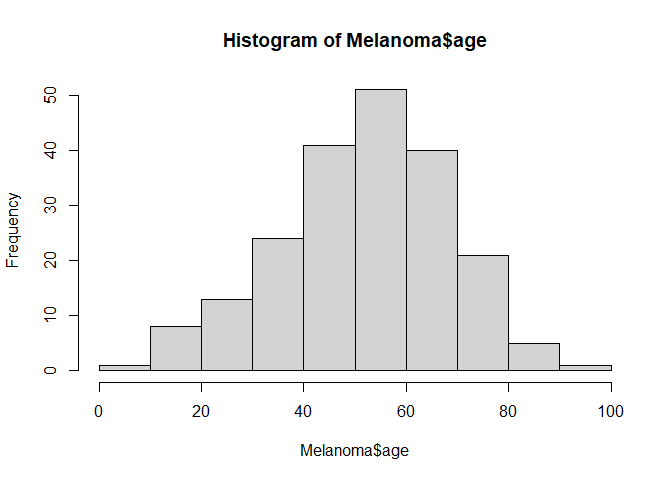
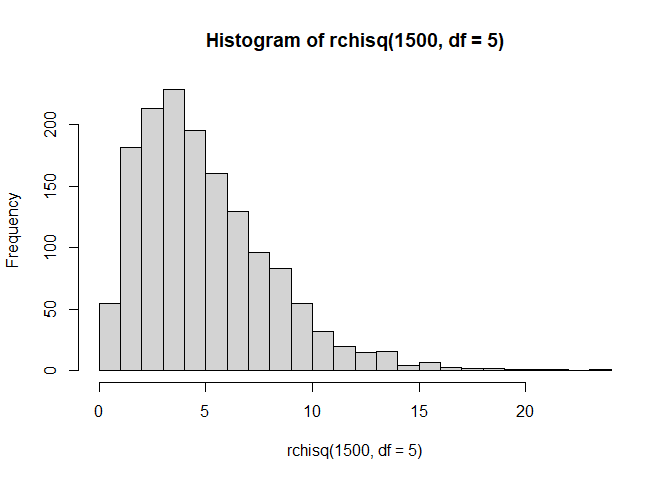

Week 1 practice quiz
================
Haixu Leng
5/19/2021

## 1. *x* = 1 : 100, find the value of $\\sum\\limits\_{i}^n ln(x\_{i})$

``` r
x = c(1:100)
y = sum(log(x))
```

The result is equal to 363.7393756.

## 2. How many of the elements of a\_vector are greater than or equal to 5?

     set.seed(42)
     a_vector = rpois(250, lambda = 6)

``` r
set.seed(42)
a_vector = rpois(250, lambda = 6)
n = length(a_vector[a_vector >= 5])
```

There are 181 elements in `a_vector` that are greater than or equal to
5.

## 3. Create a new vector **y**, which adds 5 to the elements stored in odd indices of **x** and subtracts 10 from the elements stored in even indices of **x**. Calculate the standard deviation of this new vector.

``` r
x = 1:100
odd_vector = rep(c(1,0), length(x) / 2)
even_vector = rep(c(0,1), length(x) / 2)
y = x + 5 * odd_vector - 10 * even_vector
```

Result: 29.8481003.

## 4. Which of the following options would return the third element of the list quiz\_list? (Select all that apply.)

``` r
quiz_list = list(
  x = c(1, 2),
  y = "Hello Quiz Taker",
  z = "zz"
)

quiz_list[3]
```

    ## $z
    ## [1] "zz"

``` r
quiz_list[[3]]
```

    ## [1] "zz"

``` r
quiz_list["3"] # does not work
```

    ## $<NA>
    ## NULL

``` r
quiz_list$z
```

    ## [1] "zz"

``` r
#quiz_list$3 does not work
```

## 5. Create a histogram of age in the Melanoma dataset from the MASS package. How would you describe this data?

``` r
hist(Melanoma$age)
```

<!-- -->

``` r
hist(rchisq(1500, df = 5), breaks = 20) # example of a right skewed data
```

<!-- -->
