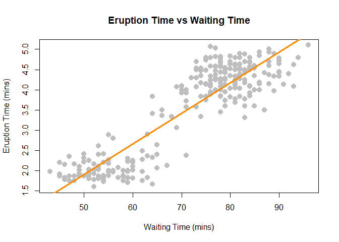

week 2 quiz
================
Haixu Leng
5/29/2021

**1**. Consider the simple linear regression model *Y* = 10 + 5*x* + *ϵ*
where *ϵ* ∼ *N*(0, *σ*<sup>2</sup> = 16). Calculate the probability that
Y is less than 6 given *x* = 0.

``` r
y_mean = 10 + 5 * 0
pnorm(6, mean = y_mean, sd = 4)
```

    ## [1] 0.1586553

**2**. what is the probability that Y is greater than 3 given that x =
-1?

``` r
y_mean = 10 + 5 * -1
pnorm(3, mean = y_mean, sd = 4, lower.tail = FALSE)
```

    ## [1] 0.6914625

**3**. what is the probability that Y is greater than 3 given that x =
-2?

``` r
y_mean = 10 + 5 * -2
pnorm(3, mean = y_mean, sd = 4, lower.tail = FALSE)
```

    ## [1] 0.2266274

**4**. Suppose we would like to predict the duration of an eruption of
the Old Faithful geyser in Yellowstone National Park based on the
waiting time before an eruption. Fit a simple linear model in R that
accomplishes this task.

``` r
result = lm(eruptions~waiting, data = faithful)
coefficients(result)
```

    ## (Intercept)     waiting 
    ## -1.87401599  0.07562795

**6** Use the fitted model to predict the duration of an eruption based
on a waiting time of 80 minutes.

``` r
coefficients(result)[[1]] + coefficients(result)[[2]] * 80
```

    ## [1] 4.17622

Answer: 4.1762198 mins.

**7** Use the fitted model to predict the duration of an eruption based
on a waiting time of 120 minutes.

``` r
coefficients(result)[[1]] + coefficients(result)[[2]] * 120
```

    ## [1] 7.201338

Answer: 7.2013378 mins.

**8**. Of the predictions that you made for 80 and 120 minutes, which is
more reliable?

``` r
plot(eruptions ~ waiting, data = faithful,
     xlab = "Waiting Time (mins)",
     ylab = "Eruption Time (mins)",
     main = "Eruption Time vs Waiting Time",
     pch = 20,
     cex = 2,
     col = "gray")
abline(result, lwd = 3, col = "darkorange")
```

<!-- -->

Answer: I think the prediction on 80 minutes waiting time is more
reliable, because we don’t have data that waits 120 minutes.

**9**. Calculate the RSS for the fitted model.

$RSS = \\sum\\limits\_{i=1}^n (y\_i - \\hat y)^2$

``` r
y_i = faithful$eruptions
y_hat = coefficients(result)[[1]] + coefficients(result)[[2]] * faithful$waiting
RSS = sum((y_i - y_hat)^2)
```

Answer: 66.5617757.

**10**. What proportion of the variation in eruption duration is
explained by the linear relationship with waiting time?

$SST = \\sum\\limits\_{i=1}^n (y\_i - \\bar y)^2$

$R^2 = \\frac{SST - RSS}{SST}$

``` r
y_mean = mean(y_i)
SST = sum((y_i - y_mean)^2)
(SST - RSS) / SST
```

    ## [1] 0.8114608

**11**. Calculate the standard deviation of the residuals of the fitted
model.

``` r
# manual calculation
e = y_i - y_hat
n = length(e)
s2_e = sum(e^2) / (n - 2)
sqrt(s2_e)
```

    ## [1] 0.4965129

``` r
# get the result from the summary
summary(result)
```

    ## 
    ## Call:
    ## lm(formula = eruptions ~ waiting, data = faithful)
    ## 
    ## Residuals:
    ##      Min       1Q   Median       3Q      Max 
    ## -1.29917 -0.37689  0.03508  0.34909  1.19329 
    ## 
    ## Coefficients:
    ##              Estimate Std. Error t value Pr(>|t|)    
    ## (Intercept) -1.874016   0.160143  -11.70   <2e-16 ***
    ## waiting      0.075628   0.002219   34.09   <2e-16 ***
    ## ---
    ## Signif. codes:  0 '***' 0.001 '**' 0.01 '*' 0.05 '.' 0.1 ' ' 1
    ## 
    ## Residual standard error: 0.4965 on 270 degrees of freedom
    ## Multiple R-squared:  0.8115, Adjusted R-squared:  0.8108 
    ## F-statistic:  1162 on 1 and 270 DF,  p-value: < 2.2e-16
