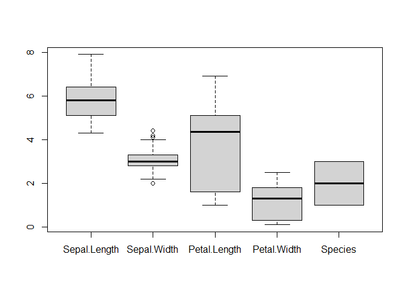
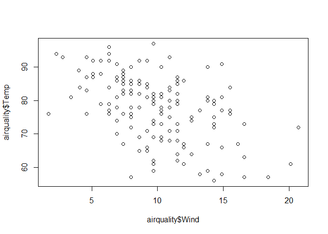

week 1 quiz
================
Haixu Leng
5/20/2021

## 1. How many individuals in the Melanoma dataset from the MASS package died from a melanoma?

``` r
library(MASS)
str(Melanoma)
```

    ## 'data.frame':    205 obs. of  7 variables:
    ##  $ time     : int  10 30 35 99 185 204 210 232 232 279 ...
    ##  $ status   : int  3 3 2 3 1 1 1 3 1 1 ...
    ##  $ sex      : int  1 1 1 0 1 1 1 0 1 0 ...
    ##  $ age      : int  76 56 41 71 52 28 77 60 49 68 ...
    ##  $ year     : int  1972 1968 1977 1968 1965 1971 1972 1974 1968 1971 ...
    ##  $ thickness: num  6.76 0.65 1.34 2.9 12.08 ...
    ##  $ ulcer    : int  1 0 0 0 1 1 1 1 1 1 ...

Based on the documentation of **MASS** library, the patient who died
from melanoma will have status as 1.

``` r
n = length(Melanoma$status[Melanoma$status == 1])
```

There are 57 patients who died from a melanoma.

## 2. What is the average age of individuals in the Melanoma dataset from the MASS package who are alive?

Based on the documentation of **MASS** library, the patient who are
alive will have status as 2.

``` r
n = length(Melanoma$status[Melanoma$status == 2])
ave_age = mean(Melanoma$age[Melanoma$status == 2])
```

There are 134 patients who are alive, and the average age is 50.0074627.

## 3. Which animal in the mammals dataset from the MASS package has the largest brain weight relative to its body weight (that is, the largest brain weight to body weight ratio)?

``` r
library(MASS)
brain_body_ratio = mammals$brain / mammals$body
row.names(mammals)[which.max(brain_body_ratio)]
```

    ## [1] "Ground squirrel"

The answer should be Ground squirrel.

## 4. Based on this plot, which variable is the most variable? Calculate the standard deviation of this variable. (Use the code block above.)

``` r
?iris
```

    ## starting httpd help server ... done

``` r
boxplot(iris)
```

<!-- -->

The standard deviation of Petal.Length is 1.7652982

## 5.

     str(z)

     min(z[[1]])

     max(z[[2]])

     mean(z[[3]])

## 6. Where were the measurements taken in the airquality dataset?

``` r
str(airquality)
```

    ## 'data.frame':    153 obs. of  6 variables:
    ##  $ Ozone  : int  41 36 12 18 NA 28 23 19 8 NA ...
    ##  $ Solar.R: int  190 118 149 313 NA NA 299 99 19 194 ...
    ##  $ Wind   : num  7.4 8 12.6 11.5 14.3 14.9 8.6 13.8 20.1 8.6 ...
    ##  $ Temp   : int  67 72 74 62 56 66 65 59 61 69 ...
    ##  $ Month  : int  5 5 5 5 5 5 5 5 5 5 ...
    ##  $ Day    : int  1 2 3 4 5 6 7 8 9 10 ...

``` r
?airquality
```

## 7. Using the airquality dataset, what is the average wind speed in May ?

``` r
wind_in_may = airquality$Wind[airquality$Month == 5]
ave_wind_in_may = mean(wind_in_may)
```

The answer is 11.6225806

## 8. Using the airquality dataset, what is the average ozone measurement? Hint: read the documentation of any function that returns an unexpected result. You will likely find a solution to the issue.

``` r
mean(airquality$Ozone, na.rm = TRUE)
```

    ## [1] 42.12931

The answer is 42.1293103

## 9. Using the airquality dataset, create a scatter plot to compare windspeed and temperature. Based on this plot, you believe that:

``` r
plot(airquality$Wind, airquality$Temp)
```

<!-- --> There
seems to be a weak correlation between wind speed and temperature. When
the temperature increases, the wind speed decreases.

## 10. What proportion of the elements of x are larger than 2 in magnitude?

``` r
set.seed(1337)
x = rnorm(10000)
index_larger_than_2 = x > 2 | x < -2
num_x_mag_larg_2 = length(index_larger_than_2[index_larger_than_2 == TRUE])
num_x_mag_larg_2 / length(x)
```

    ## [1] 0.0444

The answer is 0.0444

## 11. Write a function called f that has a single argument input with a default value of 42 which is assumed to be a vector of numeric values. The function should output a vector that is input but with any negative values replaced with 0.

``` r
f <- function(input = c(42)) {
  output = rep(0, length(input)) # initialize output
  for(index in 1:length(input)){
    output[index] = ifelse(input[index] < 0, 0, input[index])
  }
  return(output)
}

# a test
f(c(-1, 2, -3, 4, -5))
```

    ## [1] 0 2 0 4 0

``` r
# quiz
set.seed(42)
x = rnorm(100, mean = 0, sd = 10)
mean(f(input = x)) - f()
```

    ## [1] -37.70725

## 12. Create three vectors x0, x1, and y. Each should have a length of 30 and store the following:

``` r
# create vectors x0 and x1
n = 30

# x0: Each element should be the value 1 
x0 = rep(1, n)

#x1: The first 30 square numbers, starting from 1 (so 1, 4, 9, etc.) 
x1 = (1:n)^2

set.seed(42)
y  = 5 * x0 + x1 + rnorm(n = 30, mean = 0 , sd = 1)
```

The mean of y is 320.2352535.

## 13. Create a matrix X with columns x0 and x1. Report the sum of the elements in rows 17 and 19.

``` r
# x0: Each element should be the value 1 
x0 = rep(1, n)

#x1: The first 30 square numbers, starting from 1 (so 1, 4, 9, etc.) 
x1 = (1:n)^2

m = cbind(x0, x1)
m[17,]
```

    ##  x0  x1 
    ##   1 289

``` r
m[19,]
```

    ##  x0  x1 
    ##   1 361

The sum is 652

## 14. Use matrix operations to create a new matrix beta\_hat defined as follows. Report the sum of the values stored in this matrix.

*β̂* = (*X*<sup>*T*</sup>*X*)<sup> − 1</sup>*X*<sup>*T*</sup>*y*

``` r
# create vectors x0 and x1
n = 30

# x0: Each element should be the value 1 
x0 = rep(1, n)

#x1: The first 30 square numbers, starting from 1 (so 1, 4, 9, etc.) 
x1 = (1:n)^2

set.seed(42)
y  = 5 * x0 + x1 + rnorm(n = 30, mean = 0 , sd = 1)

x = cbind(x0, x1)

x_t = t(x)

beta = solve(x_t %*% x) %*% (x_t %*%y)
```

The sum of *β̂* is 6.4278989

## 15. Perform and report the result of the following operation

*ŷ* = *X**β̂*

$\\sum\_{i=1}^{30}(y\_i - \\hat y\_i)^2$

``` r
y_hat = x %*% beta
result = sum((y - y_hat)^2)
```

The result is 42.6769814
